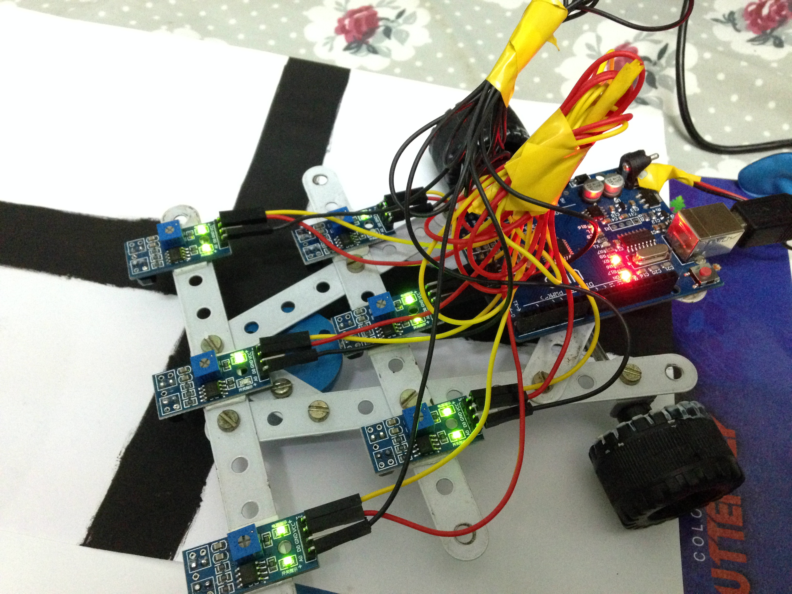

# Maze-Solver-Robot-Algorithm-Arduino
## Introduction
The algorithm detects the various nodes in a maze formed with black lines using a line follower robot and then computes the best path for minimum turns from start to end point.

## Project Description
The embeded c code is in Arduino languge and can be directly dumped to any arduino software, also the various modules of codes are presented seperately for better understanding and integrating with other codes of the user
- **IRRS Sensor Calibration**
 The 6 IR Reflectance Sensors are used which give the intensity of black and white colour
use *Irrs_codes.ino* for geting analog data and *irrs_min_max.ino* for calibrating the minimum and maximum intensity values which change according to the environment, thus making the robot an adaptable to all lighting conditions.
- **Solving string path**
 Use the *maze_solve.ino* for solving the string of turns made by the robot in the first time to compute the best path. For more info regarding the string and the alogorithm see https://www.pololu.com/file/0J195/line-maze-algorithm.pdf whre the robot can work in two ways while reading - right justified (Always turns right) or left. Two functions are there in the code the best function can be used acccording to the path given. A C language program is also written *Nodes String Solver in C language.cpp* for integration to other languages.
- **Node Sensing and Inference**
 *Node_checking.ino* can be used with just the sensors and the conditions for detection of nodes can be changed according to your positions the positions i used as shown in *image Sensor_Positions.JPG*, *node_version_2.ino* works with controling the motors as well this code slows down the speed when a node is approaching for better detection.
     
- **Final Code**
 *Integrated_Code.ino* is the final code for the maze solver robob which consista of the the above functions.
Change the conditions for detecting nodes accoring to the sensor array configuration of your robot.
